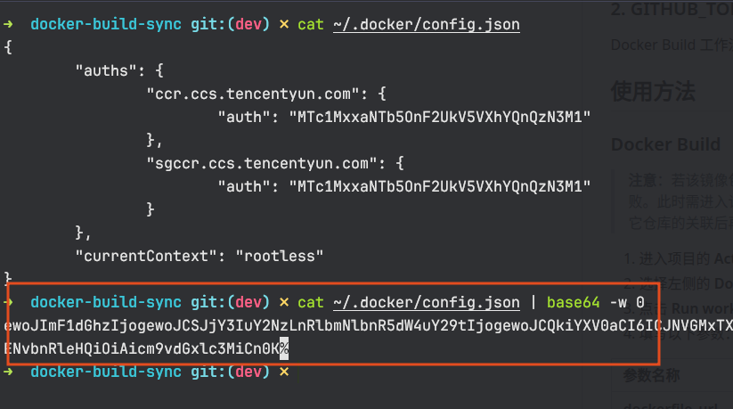
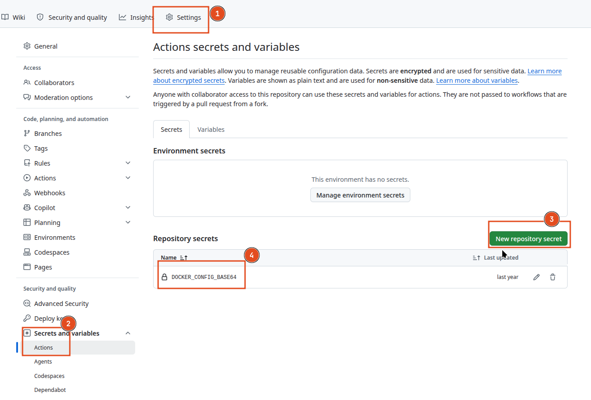
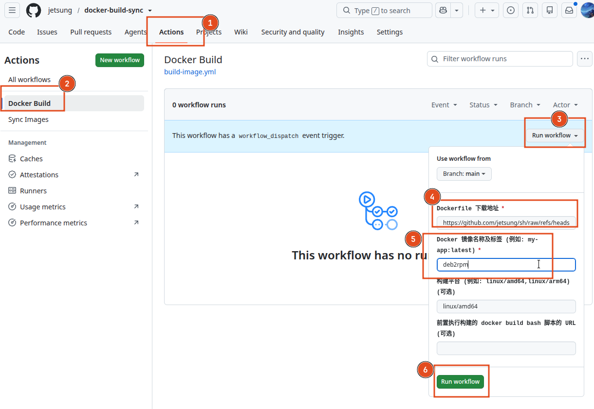
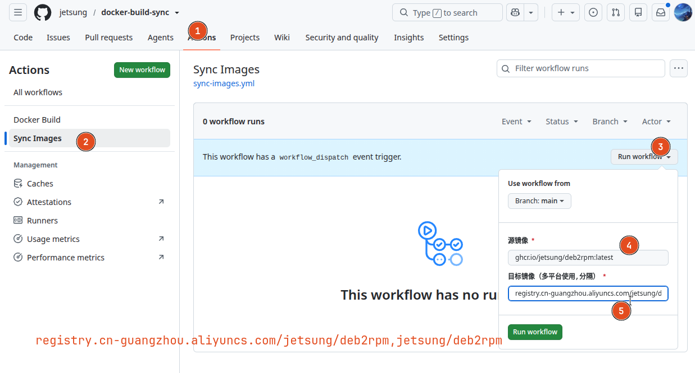

# Docker Image Build & Sync

本项目利用 GitHub Actions 实现 Docker 镜像的构建与跨仓库同步:通过 `docker buildx` 构建多平台镜像并推送至 GHCR,通过 `skopeo` 将镜像快速同步、复制到不同镜像仓库。

包含四个工作流:

- **Docker Build** ([build-image.yml](.github/workflows/build-image.yml)):根据 Dockerfile 构建多架构镜像并推送至 GHCR。
- **Sync Images** ([sync-images.yml](.github/workflows/sync-images.yml)):使用 `skopeo copy --all` 将镜像同步到多个目标仓库。
- **Docker Cache** ([docker-cache.yml](.github/workflows/docker-cache.yml)):使用 `docker` CLI 将单个镜像复制到目标注册表，目标注册表认证信息通过密钥加密后由工作流解密登录。
- **Build nginx-acme** ([nginx-acme.yml](.github/workflows/nginx-acme.yml)):构建 [nginx-acme](https://github.com/nginx/nginx-acme) 动态模块 `ngx_http_acme_module.so` 并发布为 GitHub Release。

## 配置说明

在使用此流水线之前，必须在 GitHub 项目的 **Settings > Secrets and variables > Actions** 中配置以下 Secrets：

### 1. DOCKER_CONFIG_BASE64 (Sync Images 工作流必填)

用于镜像仓库的登录认证。该值是 Docker 配置文件 `config.json` 的 Base64 编码字符串。

**获取方法：**

在本地终端执行以下命令（请确保已先执行 `docker login` 登录了相关仓库）：

> **注意**：`docker login` 实际写入的配置文件路径取决于执行登录命令所使用的用户。普通用户默认保存在 `~/.docker/config.json`（`~` 对应该用户的家目录）；若使用 `root` 用户登录，则通常保存在 `/root/.docker/config.json`，而非 `~/.docker/config.json`（非 root 用户的家目录下）。请确认登录时所用的用户，并取对应用户家目录下的 `config.json` 文件进行编码。

```bash
# Linux / macOS（以实际登录用户对应的路径为准，例如普通用户）
cat ~/.docker/config.json | base64 -w 0

# 若使用 root 用户登录，则路径通常为
cat /root/.docker/config.json | base64 -w 0

# 如果没有 base64 命令，可以使用 python（同样注意替换为正确的路径）
cat ~/.docker/config.json | python3 -c "import base64,sys; print(base64.b64encode(sys.stdin.read().encode()).decode())"
```



复制输出的字符串，并将其作为 `DOCKER_CONFIG_BASE64` 的值保存到 GitHub Secrets 中。



### 2. GITHUB_TOKEN (Docker Build / Build nginx-acme 工作流)

Docker Build 工作流使用 GitHub 自动提供的 `GITHUB_TOKEN` 登录 GHCR；Build nginx-acme 工作流使用 `GITHUB_TOKEN` 创建 Release 标签与 GitHub Release。二者均无需额外配置。

### 3. TARGET_AUTH_KEY (Docker Cache 工作流必填)

用于解密 `target_auth_secret` 的密钥字符串（即你加密时使用的那一个）。

**如何生成 target_auth_secret：**

1. 先从 Docker 配置文件 `~/.docker/config.json` 中提取目标注册表的 `auth` 值（该值是 Base64 编码的 `用户名:密码`），请将下面的 `ghcr.io` 替换为你的目标注册表域名：

```bash
AUTH=$(jq -r '.auths["ghcr.io"].auth' ~/.docker/config.json)
```

2. 使用你设置的密钥字符串对 `auth` 值加密，输出即为 `target_auth_secret`（将 `你的密钥` 替换为实际密钥）：

```bash
printf '%s' "$AUTH" | openssl enc -aes-256-cbc -pbkdf2 -a -A -pass pass:"你的密钥"
```

> **注意**：
> - 加密与解密必须使用同一密钥，且算法固定为 `aes-256-cbc + pbkdf2`。
> - 运行时在 **Run workflow** 表单中把加密结果填入 `target_auth_secret` 输入框；密钥本身则保存为 GitHub Secret `TARGET_AUTH_KEY`。
> - `target_image` 中的注册表域名（如 `ghcr.io`）必须与提取 `auth` 值时使用的注册表一致。

## 使用方法

### Docker Build（构建并推送镜像）

> **注意**：若该镜像包（package）此前已由其它仓库的构建流水线构建并关联了仓库源，推送到 GHCR 时可能会失败。此时需进入该包所在项目的 **Package settings**（包设置），删除其 **Repository source**（仓库源），解除与其它仓库的关联后再重新构建。

1. 进入项目的 **Actions** 选项卡。
2. 选择左侧的 **Docker Build** 工作流。
3. 点击 **Run workflow** 下拉按钮。
4. 填写以下参数：

| 参数名称 | 说明 | 示例 |
| :--- | :--- | :--- |
| **dockerfile_url** | Dockerfile 下载地址（必填） | `https://example.com/Dockerfile` |
| **image_name** | 镜像名称及标签（必填） | `my-app:latest` |
| **platforms** | 构建平台，逗号分隔（可选） | `linux/amd64,linux/arm64` |
| **build_script_url** | 前置构建 bash 脚本 URL（可选） | `https://example.com/build.sh` |

5. 点击 **Run workflow** 开始构建。



### Sync Images（同步镜像）

> **注意**：`DST_IMAGE` 中每个目标镜像的注册中心（即地址中的域名或仓库前缀部分，例如 `ghcr.io`、`myreg.com`）必须已在 **DOCKER_CONFIG_BASE64** 配置文件中预先登录并配置好对应的账号及密码。若未在该 Docker 配置文件（登录用户家目录下的 `config.json`，例如普通用户为 `~/.docker/config.json`、root 用户为 `/root/.docker/config.json`）中配置相应注册中心的认证信息，同步到该目标仓库时将会因认证失败而报错。请在执行同步前，确保已对 `DST_IMAGE` 涉及的所有注册中心执行过 `docker login`（使用正确的用户）并重新生成 `DOCKER_CONFIG_BASE64` 保存到 GitHub Secrets 中。

1. 进入项目的 **Actions** 选项卡。
2. 选择左侧的 **Sync Images** 工作流。
3. 点击 **Run workflow** 下拉按钮。
4. 填写以下参数：

| 参数名称 | 说明 | 示例 |
| :--- | :--- | :--- |
| **SRC_IMAGE** | 源镜像地址（包含仓库地址） | `docker.io/library/alpine:latest` |
| **DST_IMAGE** | 目标镜像地址。如有多个目标，使用英文逗号 `,` 分隔。 | `ghcr.io/username/alpine:latest,myreg.com/alpine:latest` |

5. 点击 **Run workflow** 开始同步。



### Docker Cache（复制镜像）

> **注意**：`target_auth_secret` 是目标注册表 `auth` 值（Base64 编码的 `用户名:密码`）使用密钥加密后的结果，生成方法见上文「TARGET_AUTH_KEY」一节。`target_image` 中的注册表域名必须与加密所用 auth 对应的注册表一致（例如都使用 `ghcr.io`）。

1. 进入项目的 **Actions** 选项卡。
2. 选择左侧的 **Docker Cache** 工作流。
3. 点击 **Run workflow** 下拉按钮。
4. 填写以下参数：

| 参数名称 | 说明 | 示例 |
| :--- | :--- | :--- |
| **source_image** | 源镜像地址（包含仓库地址） | `docker.io/library/alpine:latest` |
| **target_image** | 目标镜像地址，必须包含注册表域名（必填） | `ghcr.io/username/alpine:latest` |
| **target_auth_secret** | 目标注册表 auth 值经密钥加密后的结果（必填） | `U2FsdGVkX1...` |

5. 点击 **Run workflow** 开始复制。工作流会先用 `TARGET_AUTH_KEY` 解密认证信息并登录目标注册表，再执行 `docker pull` → `docker tag` → `docker push`。

### Build nginx-acme（构建 nginx-acme 动态模块）

> **注意**：该工作流使用 GitHub 自动提供的 `GITHUB_TOKEN` 创建 Release 标签与 GitHub Release，无需额外配置 Secrets。若远端已存在同名标签/Release，会自动删除重建，支持幂等更新。

该工作流基于 [nginx/nginx-acme](https://github.com/nginx/nginx-acme) 构建 Nginx 动态模块 `ngx_http_acme_module.so`:在指定的 Rust 基础镜像中编译 Nginx 源码与 nginx-acme 模块，产物同时以 Actions Artifact 和 GitHub Release 附件形式提供。Release 标签格式为 `nginx-acme-<acme版本>-<nginx版本>-<os-id>`(例如 `nginx-acme-0.4.1-1.27.4-debian13.5`)。

1. 进入项目的 **Actions** 选项卡。
2. 选择左侧的 **Build nginx-acme** 工作流。
3. 点击 **Run workflow** 下拉按钮。
4. 填写以下参数：

| 参数名称 | 说明 | 示例 |
| :--- | :--- | :--- |
| **nginx_version** | Nginx 版本，留空自动获取最新主线版（可选） | `1.27.4` |
| **base_image** | Rust 基础镜像 tag（必填） | `1-bookworm`、`slim-bookworm`、`alpine3.21`、`1-alpine` |
| **acme_version** | nginx-acme 版本，留空自动获取最新版（可选） | `0.4.1` |

5. 点击 **Run workflow** 开始构建。

**安装模块：**

1. 通过以下命令提取 Nginx 的 modules 文件夹路径（即模块安装目录）：

```bash
nginx -V 2>&1 | grep -oP "modules-path=\K[^ ]*"
```

2. 将下载的 `ngx_http_acme_module.so` 文件保存到上述命令提取出的 modules 文件夹中。
3. 在 `nginx.conf` 配置文件的顶层（`events` 块之前）添加加载指令：

```nginx
load_module modules/ngx_http_acme_module.so;
```

> **注意**：`load_module` 指令必须在 `events` 块之前指定，且该模块要求 Nginx 已启用 `--with-compat` 与 `--with-http_ssl_module` 编译选项（构建产物已包含），加载后需使用 `nginx -t` 校验配置无误再执行 `nginx -s reload`。

## 功能特性

- **多架构构建**：使用 `docker buildx` 构建 `linux/amd64`、`linux/arm64` 等多平台镜像并推送至 GHCR。
- **全平台同步**：使用 `skopeo copy --all`，确保源镜像的所有架构（amd64, arm64 等）都被同步到目标仓库。
- **多目标支持**：一次运行可将镜像推送到多个不同的镜像仓库。
- **可选构建脚本**：支持下载并执行自定义 bash 构建脚本，灵活扩展构建流程。
- **自动安装 Skopeo**：流水线会自动从 [jetsung/install-skopeo](https://github.com/jetsung/install-skopeo) 获取并安装最新的 Skopeo。
- **nginx-acme 动态模块构建**：支持一键构建 `ngx_http_acme_module.so` 动态模块，可指定或自动获取 Nginx 主线版与 nginx-acme 最新版本，产物以 GitHub Release 发布。

## 许可证

[Apache License 2.0](LICENSE)

## 仓库镜像

[MyCode](https://git.jetsung.com/jetsung/docker-build-sync) ● [AtomGit](https://atomgit.com/jetsung/docker-build-sync) ● [GitHub](https://github.com/jetsung/docker-build-sync)
